# Survey figure assets

This directory holds the figures of **Proactive AI for Superintelligent Agents**
as the manuscript shows them, ready for the web: one lossless WebP per figure,
2400 px wide.

Each one is exported from the manuscript's own figure: rendered, cropped the way
the manuscript shows it, and titled with the lead of its caption. The `alt` text
is written by hand.

The manuscript and its PDF are intentionally not included. For each figure,
[`manifest.json`](manifest.json) records the title, the alt text and the pixel
size.

## Gallery

| Figure | Topic | Suggested use |
| --- | --- | --- |
| 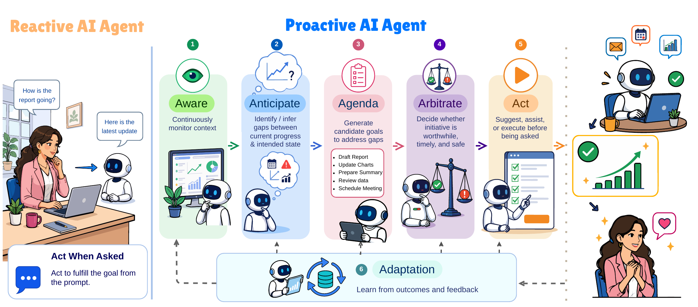 | Proactive vs. reactive AI agents | Page hero and survey overview |
| 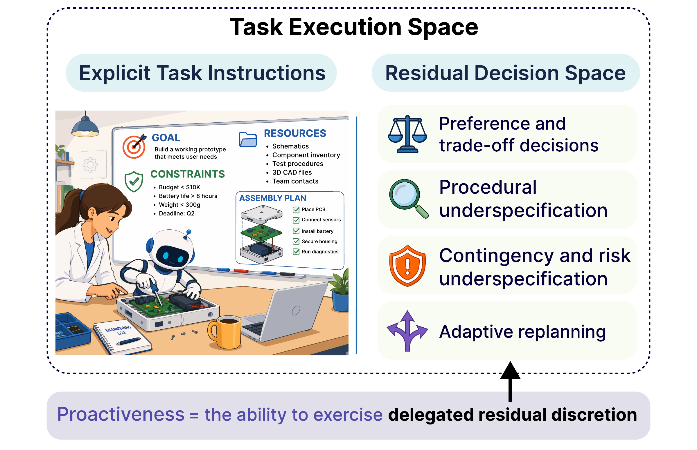 | Proactiveness as delegated residual discretion | Definition section |
| 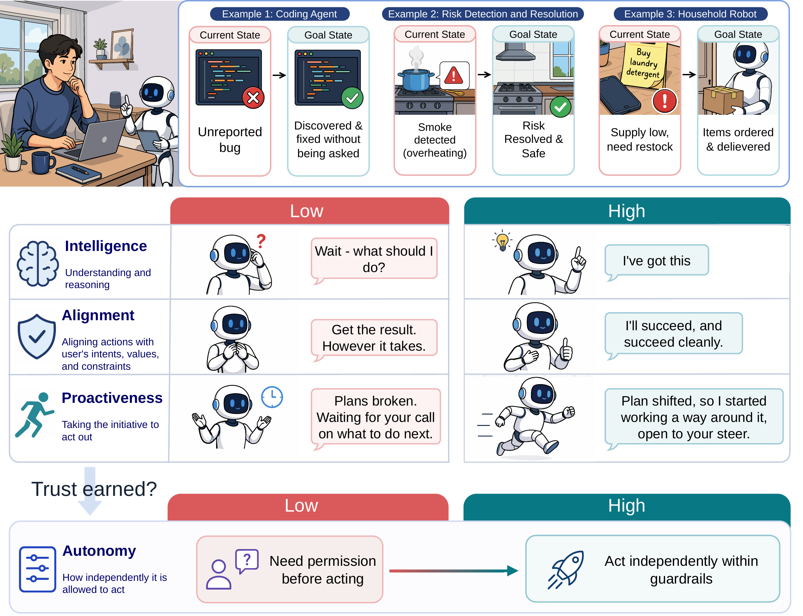 | From complementary capabilities to earned autonomy | Introduction or definition section |
| 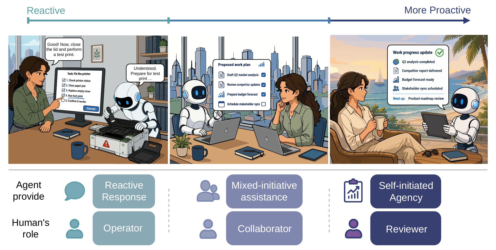 | The reactivity-proactivity spectrum | Definition section |
| 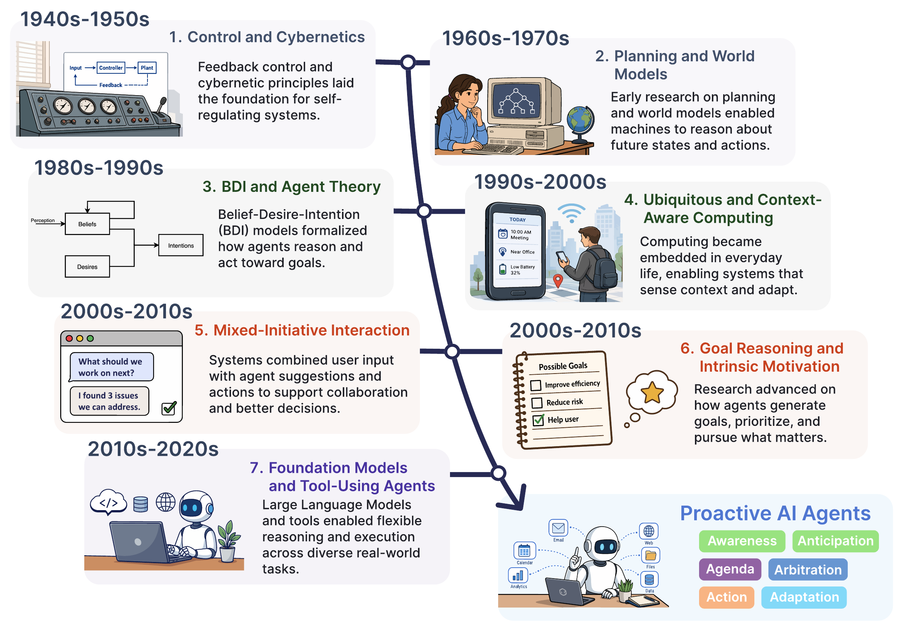 | Historical foundations of increasingly open-ended initiative | History section |
| 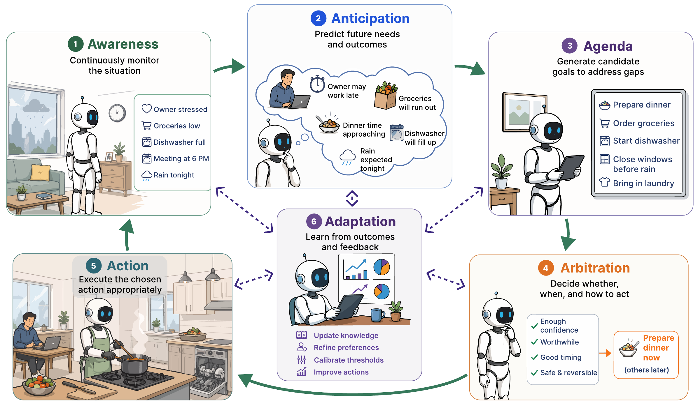 | Six interacting capacities for exercising proactive discretion | Mechanism overview |
| 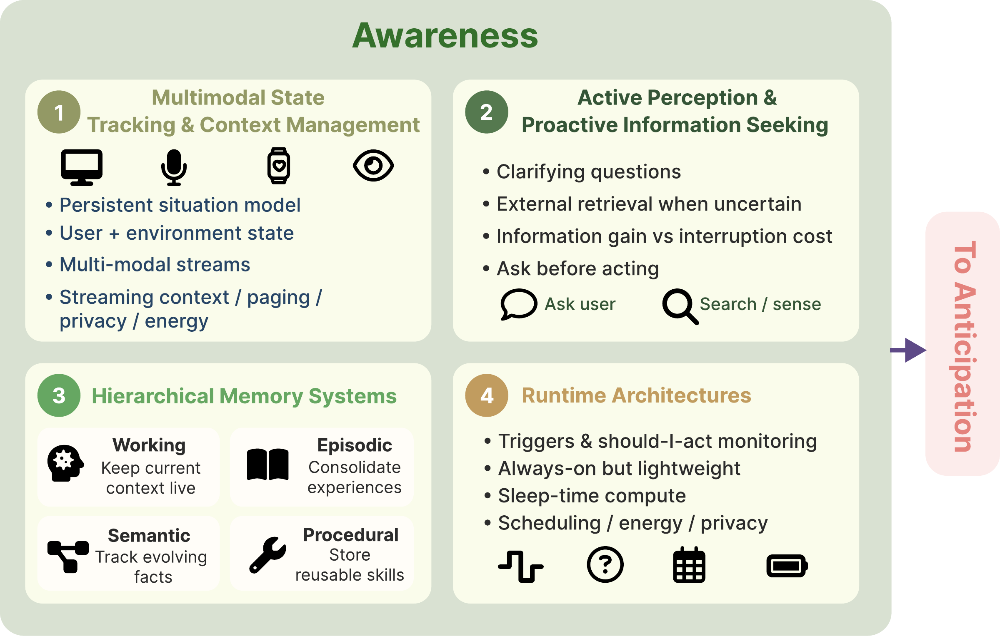 | Awareness grounds initiative in decision-relevant context | Mechanism detail |
| 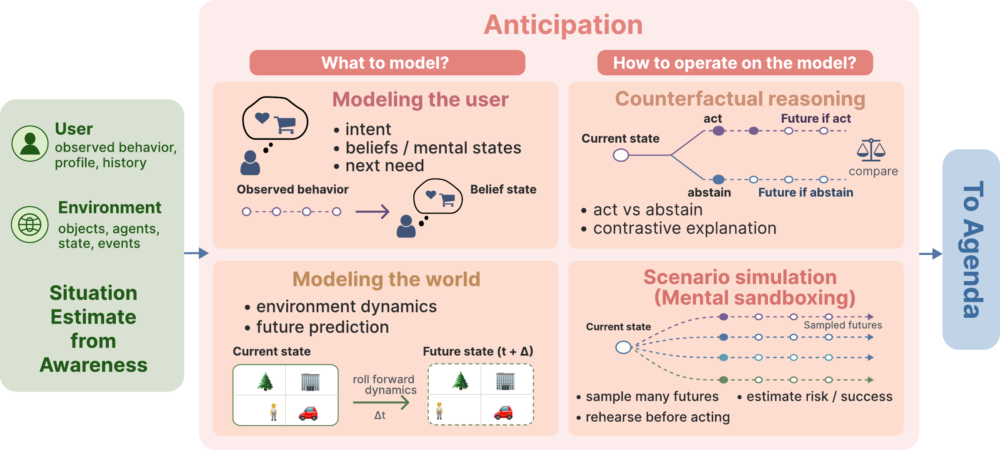 | Anticipation establishes why an intervention may be worth initiating | Mechanism detail |
| 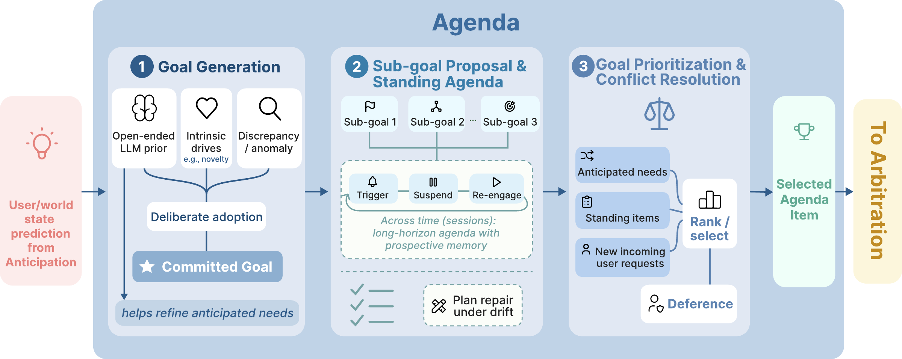 | Agenda bridges foresight and sustained goal pursuit | Mechanism detail |
| 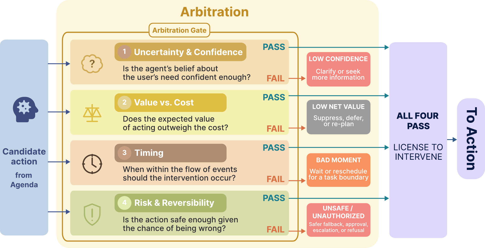 | Arbitration: a worthwhile goal is not yet a warranted intervention | Mechanism detail |
| 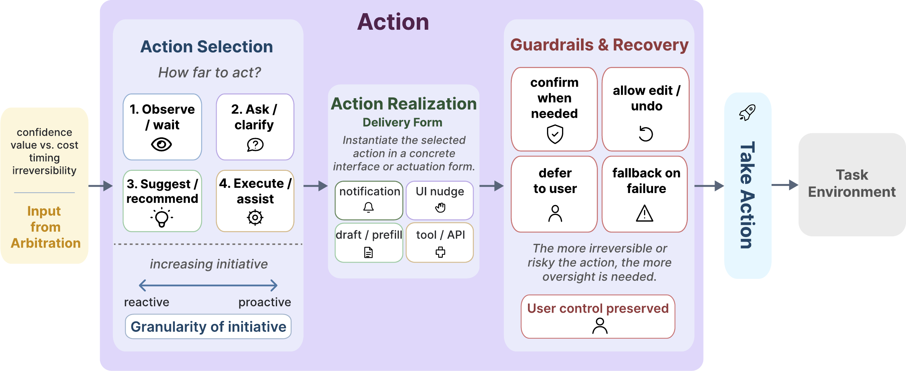 | Action: exercising discretion while preserving human control | Mechanism detail |
| 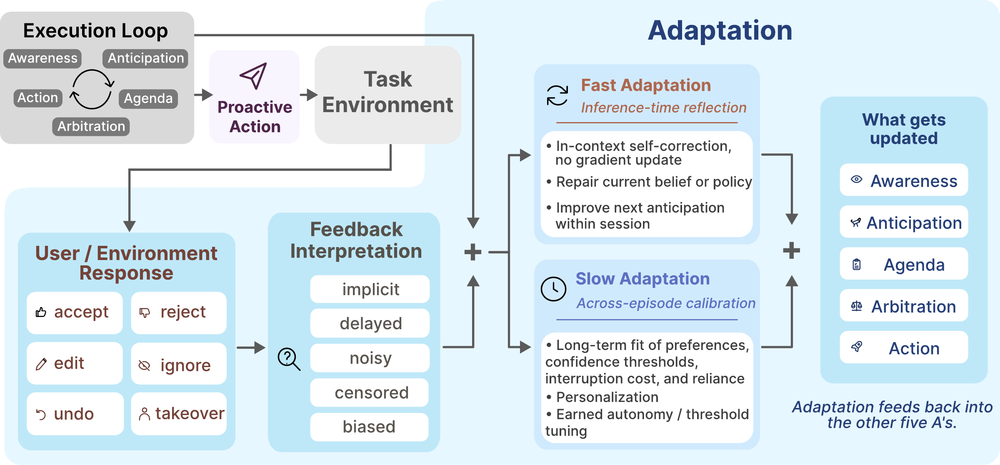 | Adaptation: learning whether initiative was warranted | Mechanism detail |
| 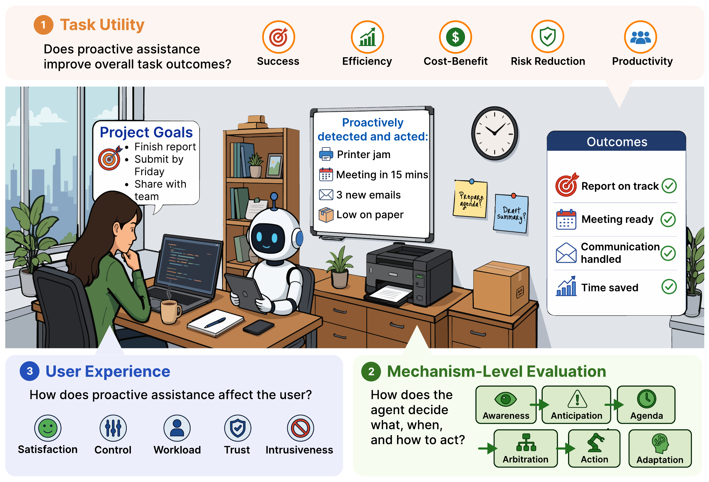 | Evaluating proactiveness requires evidence beyond task completion | Evaluation section |
| 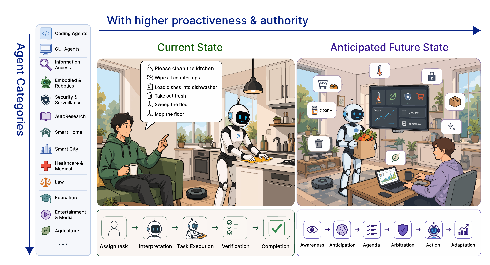 | From executing assigned tasks to sustaining delegated objectives | Applications introduction |
| 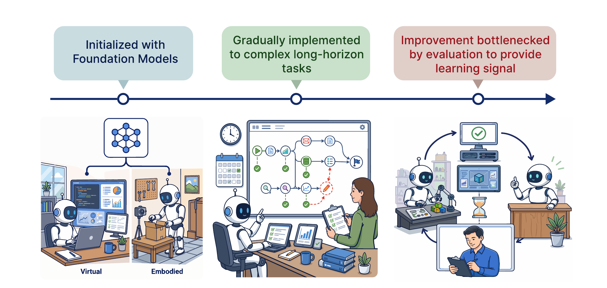 | Three cross-industry trends in proactive AI | Applications conclusion |

## Using an asset

Use a URL relative to the page, and carry the size and the `alt` text over from
[`manifest.json`](manifest.json):

```html

```

The figures are drawn on white. On a dark page, give them a white plate rather
than letting the page show through.

## Attribution

When using these figures outside this repository, cite the survey and link back
to this repository. The repository's [license](../../LICENSE) applies unless a
file is explicitly marked otherwise.
